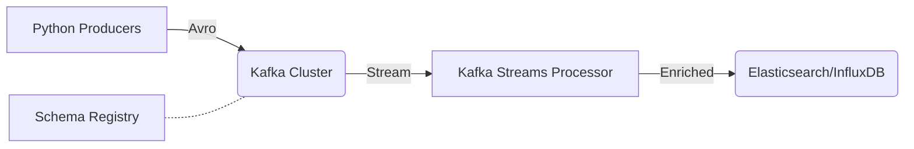

# 🎡 Kafka Streaming Pipeline

[](https://kafka.apache.org/)
[](https://www.confluent.io/)

> High-throughput real-time telemetry processing engine using Kafka Streams and Schema Registry.

## 🏗️ Architecture



This pipeline demonstrates production-grade stream processing with Avro serialization and schema evolution.

## 🚀 Development Stack

Use the `Makefile` to orchestra the local Confluent environment:

```bash
make up
make topic
make ps
```

Access the **Confluent Control Center** at `http://localhost:9021` to monitor streams visually.

## 🛠️ Components

- **Consumer/**: Intelligent consumer group logic with rebalance listeners.
- **Producer/**: Async producers with retry policies and dead-letter queue (DLQ) support.
- **Stream-Processor/**: Complex transformations including windowed aggregations.

---
maintained by **Ramchandra Chintala**
